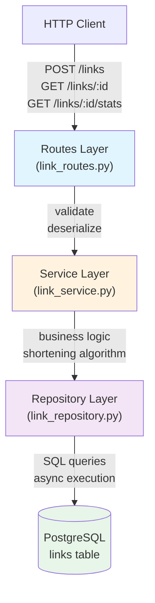
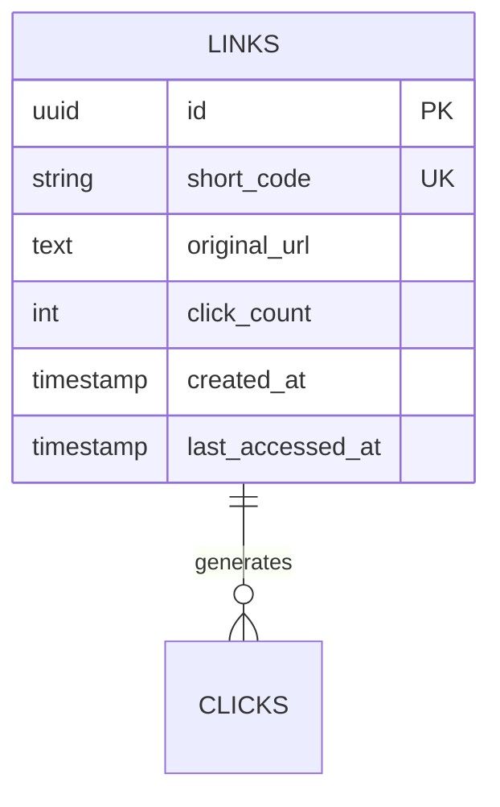

# LinkPulse

A production-style URL shortener built to deepen understanding of modern backend engineering principles and practices.

## Overview

LinkPulse demonstrates how to build a scalable, maintainable backend service with clean architecture patterns, async database operations, and analytics tracking. This project prioritizes code clarity, architectural separation of concerns, and real-world backend engineering practices over feature complexity.

## Learning Goals

- Clean layered architecture (routes → services → repositories)
- Async/await for efficient I/O
- Database migrations & schema versioning
- Analytics tracking design
- Type safety with Pydantic v2

## Tech Stack

| Component     | Technology             |
| ------------- | ---------------------- |
| Language      | Python 3.13            |
| Web Framework | FastAPI                |
| Database      | PostgreSQL             |
| ORM           | SQLAlchemy 2.0 (async) |
| Migrations    | Alembic                |
| Validation    | Pydantic v2            |

## Features

- **URL Shortening**: Convert long URLs into short, memorable codes
- **URL Redirection**: Resolve short codes back to original URLs
- **Click Tracking**: Automatic tracking of access counts per link
- **Last Access Timestamp**: Track when a link was last accessed
- **Analytics API**: Retrieve usage statistics for shortened links
- **Async Operations**: Non-blocking database queries for better concurrency
- **Clean Architecture**: Clear separation between HTTP, business, and data layers
- **Database Migrations**: Version-controlled schema changes

## Architecture

### Layered Design



**Key principles:**

- Routes only handle HTTP (validation, serialization)
- Services contain business rules (URL shortening, analytics)
- Repositories handle database queries only
- Each layer is testable independently

## API Endpoints

| Method | Endpoint                    | Description                                               |
| ------ | --------------------------- | --------------------------------------------------------- |
| `POST` | `/links`                    | Shorten a URL                                             |
| `GET`  | `/links/{short_code}`       | Redirect to original URL (increments clicks)              |
| `GET`  | `/links/{short_code}/stats` | Get link analytics (clicks, created_at, last_accessed_at) |

## Database



Key design decisions:

- `short_code` indexed for O(1) lookups
- `click_count` denormalized (avoids COUNT aggregations)
- Timestamps in UTC for consistency

## Key Learning Points

**Service vs Repository:** Services contain business logic; repositories contain only SQL queries. Decoupling makes testing easier and business logic reusable.

**Async Programming:** FastAPI + SQLAlchemy async driver handle non-blocking I/O. Multiple requests execute concurrently without thread overhead.

**Database Migrations:** Alembic tracks schema changes. Each migration is reversible and version-controlled.

**Analytics Design:** Click tracking updates happen asynchronously so redirects aren't delayed. Denormalized `click_count` avoids expensive aggregations.

## Getting Started

### Prerequisites

- Python 3.13+
- PostgreSQL 14+
- pip or uv package manager

### Installation

1. **Clone and install dependencies:**

   ```bash
   git clone https://github.com/your-username/linkpulse.git
   cd linkpulse
   pip install -r requirements.txt
   ```

2. **Set up environment variables:**

   ```bash
   cp .env.example .env
   # Edit .env with your PostgreSQL connection string
   ```

3. **Run database migrations:**

   ```bash
   alembic upgrade head
   ```

4. **Start the development server:**

   ```bash
   uvicorn app.main:app --reload
   ```

   The server runs at `http://localhost:8000`  
   Interactive API docs available at `http://localhost:8000/docs`

### Running Tests

```bash
pytest tests/ -v
```

## Project Structure

```
linkpulse/
├── app/
│   ├── main.py                 # Application entry point
│   ├── api/
│   │   └── routes/
│   │       └── link_routes.py  # HTTP endpoint handlers
│   ├── core/
│   │   └── config.py           # Configuration management
│   ├── db/
│   │   ├── models.py           # SQLAlchemy models
│   │   ├── session.py          # Database session setup
│   │   └── base.py             # Base class for models
│   ├── repositories/
│   │   └── link_repository.py  # Data access layer
│   ├── schemas/
│   │   └── link.py             # Pydantic models (validation)
│   └── services/
│       └── link_service.py     # Business logic layer
├── alembic/                    # Database migrations
│   └── versions/
├── tests/                      # Test suite
├── alembic.ini                 # Alembic configuration
├── pyproject.toml              # Project metadata & dependencies
└── README.md                   # This file
```

## Next Steps

- Redis caching for hot links
- Click history table with geolocation
- User authentication & link ownership
- Rate limiting
- Prometheus metrics & structured logging
- Docker & Kubernetes deployment

## License

This project is open source and available under the MIT License.

---

Built with ❤️ as a backend engineering learning project.
